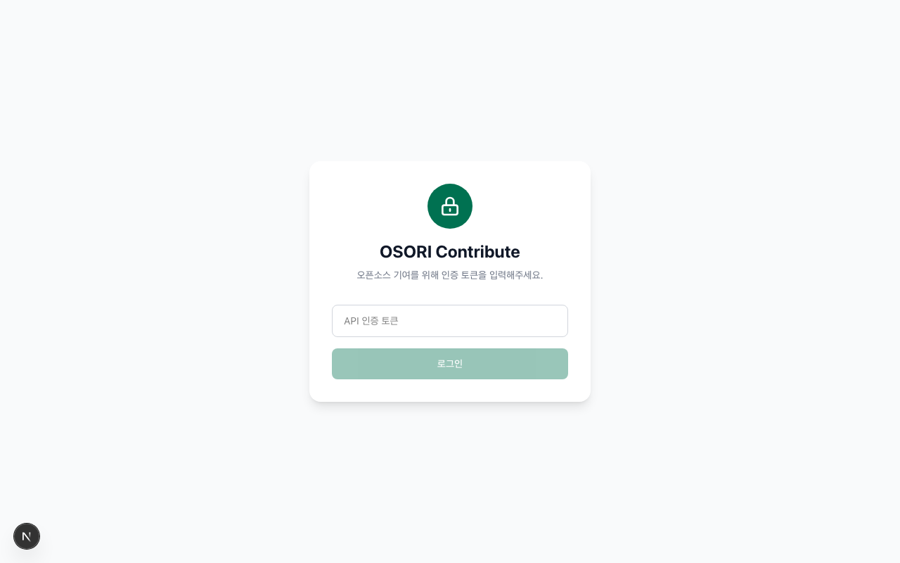
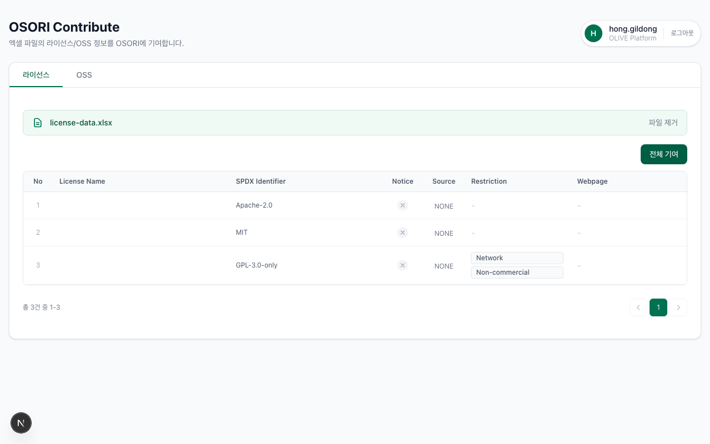
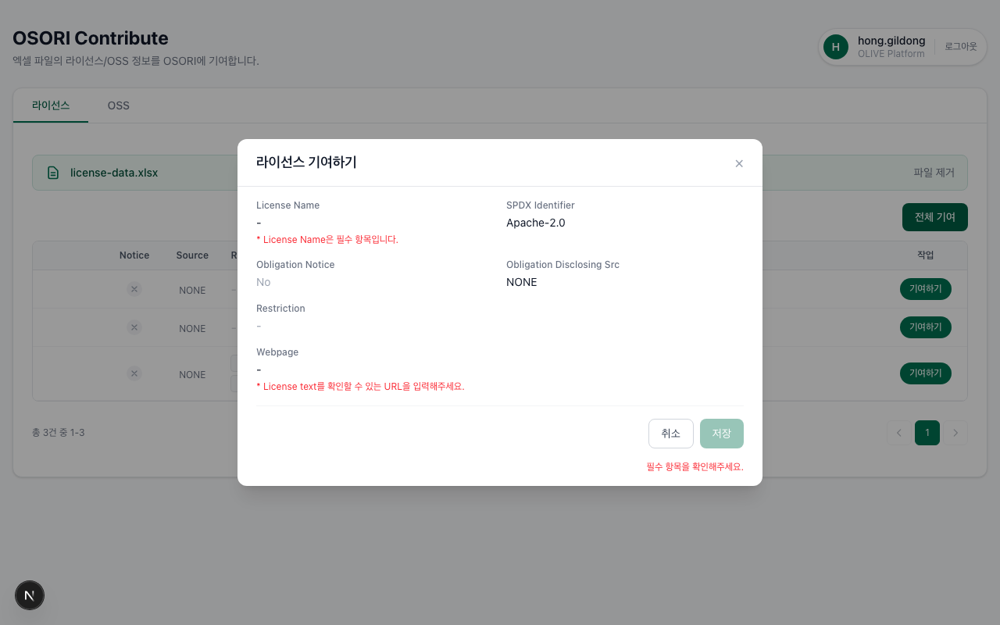
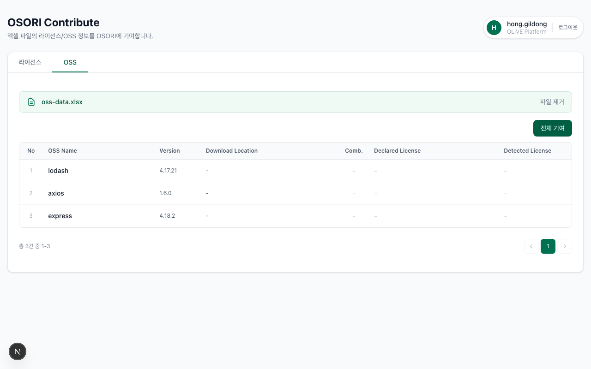
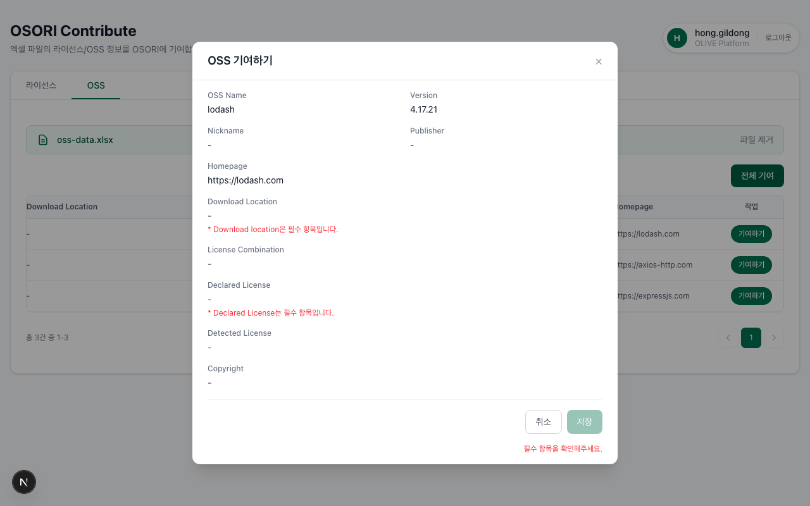

# OSORI Contribute

엑셀 파일의 라이선스/OSS 정보를 [OSORI](https://olis.or.kr) 시스템에 기여하는 웹 애플리케이션입니다.

## 기술 스택

- **Framework**: Next.js 16 (App Router)
- **UI**: React 19 + Tailwind CSS 4
- **Language**: TypeScript 5
- **Validation**: Zod 4
- **Excel**: xlsx (SheetJS)
- **Testing**: Vitest + Testing Library (61 tests)
- **Theme**: OLIVE UI 기반 녹색 계열

## 시작하기

### 사전 요구사항

- Node.js 21+
- npm

### 설치 및 실행

```bash
# 의존성 설치
npm install

# 개발 서버 실행
npm run dev

# 프로덕션 빌드
npm run build
npm start
```

개발 서버: http://localhost:3000

### Docker 실행

```bash
# 이미지 빌드
docker build -t osori-contribute .

# 컨테이너 실행
docker run -p 3000:3000 osori-contribute
```

docker-compose를 사용할 경우:

```bash
docker compose up -d
```

http://localhost:3000 으로 접속합니다.

### 테스트

```bash
# 테스트 실행
npm test

# 테스트 워치 모드
npm run test:watch
```

## 화면 가이드

### 1. 로그인

OSORI API 인증 토큰(JWT)을 입력하여 로그인합니다.



### 2. 라이선스 기여

엑셀 파일을 업로드하면 라이선스 목록이 테이블로 표시됩니다. **"전체 기여"** 버튼으로 일괄 처리하거나, 각 행의 **"기여하기"** 버튼으로 개별 처리할 수 있습니다.



개별 기여 시 모달에서 상세 정보와 검증 결과를 확인한 후 저장합니다.



### 3. OSS 기여

OSS 탭에서 엑셀을 업로드하면 OSS 목록이 표시됩니다. 라이선스와 동일하게 **"전체 기여"** 및 개별 **"기여하기"** 를 지원합니다.



OSS 기여 모달에서는 OSS Name, Version, Download Location, 라이선스 매핑 상태 등을 확인합니다.



---

## 주요 기능

### 1. 인증 (로그인/로그아웃)

OSORI API 인증 토큰(JWT)을 입력하여 로그인합니다. 토큰에서 사용자 이름과 소속을 자동으로 파싱하여 헤더에 표시합니다. 세션 동안 토큰이 유지되며, 브라우저 탭을 닫으면 자동 로그아웃됩니다.

### 2. 엑셀 업로드

라이선스 또는 OSS 탭에서 엑셀 파일(.xlsx, .xls)을 **드래그앤드롭** 하거나 **클릭하여 선택**합니다. 업로드된 엑셀은 자동으로 파싱되어 테이블 형태로 표시됩니다. 파일명이 표시되며 "파일 제거" 버튼으로 초기화할 수 있습니다.

### 3. 라이선스 기여

| 기능 | 설명 |
|------|------|
| **SPDX 자동 조회** | 기여 시 SPDX Identifier로 OSORI에서 기존 라이선스를 먼저 검색합니다. |
| **중복 방지** | 이미 등록된 라이선스는 생성을 건너뛰고 성공 처리합니다. |
| **자동 생성** | 미등록 라이선스는 OSORI API를 통해 자동 생성합니다. |
| **Restriction 매핑** | 라이선스 제한사항(Network, Non-commercial 등)을 OSORI restriction ID로 자동 매핑합니다. |
| **입력 검증** | License Name 필수, Webpage URL 형식, SPDX Identifier 유효성 등을 사전 검증합니다. |
| **기여하기 모달** | 각 행의 기여 버튼 클릭 시 상세 정보와 검증 결과를 모달로 확인합니다. |
| **전체 기여** | "전체 기여" 버튼으로 모든 항목을 순차적으로 일괄 처리합니다. 진행률이 실시간 표시됩니다. |

**기여 흐름:**
```
SPDX Identifier로 OSORI 조회
  → 존재하면 → 완료 (중복 방지)
  → 없으면 → 라이선스 생성 API 호출 → 성공/실패
```

### 4. OSS 기여

| 기능 | 설명 |
|------|------|
| **purl 자동 생성** | GitHub Download Location에서 Package URL (`pkg:github/owner/repo`)을 자동 생성합니다. |
| **OSS 중복 검사** | purl로 OSORI에서 기존 OSS를 먼저 검색합니다. |
| **버전 관리** | OSS가 존재하면 해당 버전이 있는지 추가 조회하고, 없는 버전만 생성합니다. |
| **라이선스 ID 매핑** | Declared/Detected License 이름을 OSORI 라이선스 ID로 자동 변환합니다. |
| **License Combination** | AND/OR 조합을 지원합니다. |
| **입력 검증** | Download Location URL, Copyright 형식 등을 사전 검증합니다. |
| **기여하기 모달** | 라이선스 배지, 매핑 상태, 검증 힌트를 포함한 상세 확인 모달을 제공합니다. |
| **전체 기여** | "전체 기여" 버튼으로 모든 항목을 순차적으로 일괄 처리합니다. 진행률이 실시간 표시됩니다. |

**기여 흐름:**
```
Download Location → purl 생성 (GitHub만)
  → purl로 OSORI 조회
    → OSS 존재 → oss_master_id 획득
    → OSS 없음 → OSS 생성 API → oss_master_id 획득
  → 버전 조회
    → 버전 존재 → 완료 (중복 방지)
    → 버전 없음 → 라이선스 ID 매핑 → 버전 생성 API
```

### 5. 상태 표시

각 행의 기여 상태가 버튼 UI로 실시간 표시됩니다:

| 상태 | 표시 | 설명 |
|------|------|------|
| 대기 | 녹색 "기여하기" 버튼 | 기여 전 초기 상태 |
| 이미 존재함 | 회색 "이미 존재함" | SPDX/purl 사전 조회로 이미 등록된 항목 |
| 처리 중 | 스피너 + "처리 중..." | API 호출 진행 중 |
| 완료 | 녹색 체크 "완료" | 기여 성공, 행 반투명 처리 |
| 실패 | 빨간색 "재시도" | 기여 실패, 클릭하여 재시도 가능 |

### 6. 전체 기여 (배치)

라이선스/OSS 탭에서 "전체 기여" 버튼을 클릭하면 모든 항목을 순차적으로 처리합니다:
- 진행률 표시: `처리 중... (3/25)`
- 이미 성공한 항목은 자동 건너뜀
- 검증 실패 항목은 에러 메시지와 함께 건너뜀
- 실패한 항목은 행 아래에 빨간색 에러 메시지 표시
- 완료된 항목은 반투명(opacity) 처리

### 7. 페이지네이션

데이터가 20건을 초과하면 자동으로 페이지가 나뉩니다. 현재 페이지 번호와 총 건수가 표시됩니다.

## 프로젝트 구조

```
src/
├── app/                              # Next.js App Router
│   ├── api/
│   │   ├── contribute/route.ts       # 레거시 기여 API 프록시
│   │   └── osori/
│   │       ├── licenses/route.ts     # 라이선스 CRUD API 프록시
│   │       ├── oss/route.ts          # OSS CRUD API 프록시 (purl 조회 포함)
│   │       ├── oss-versions/route.ts # OSS 버전 CRUD API 프록시
│   │       └── restrictions/route.ts # Restriction 목록 조회 프록시
│   ├── globals.css                   # Tailwind + OLIVE 테마
│   ├── layout.tsx                    # 루트 레이아웃
│   └── page.tsx                      # 메인 페이지 (탭 전환)
│
├── components/
│   ├── AuthTokenInput.tsx            # 전체 화면 로그인 폼
│   ├── Header.tsx                    # 헤더 (사용자 정보 + 로그아웃)
│   ├── TabNavigation.tsx             # 라이선스/OSS 탭 네비게이션
│   ├── ExcelUploader.tsx             # 드래그앤드롭 엑셀 업로더
│   ├── Modal.tsx                     # 공통 모달 컴포넌트
│   ├── Pagination.tsx                # 페이지네이션 컴포넌트
│   ├── ContributeButton.tsx          # 기여 버튼 (상태별 UI)
│   ├── ErrorMessage.tsx              # 에러 메시지
│   ├── LoadingSkeleton.tsx           # 로딩 스켈레톤
│   ├── LicenseTab.tsx                # 라이선스 탭 컨테이너
│   ├── LicenseList.tsx               # 라이선스 목록 + 개별/전체 기여
│   ├── LicenseContributeModal.tsx    # 라이선스 기여 확인 모달
│   ├── OssTab.tsx                    # OSS 탭 컨테이너
│   ├── DataList.tsx                   # 범용 데이터 목록 (미사용)
│   ├── OssList.tsx                   # OSS 목록 + 개별/전체 기여
│   └── OssContributeModal.tsx        # OSS 기여 확인 모달
│
├── contexts/
│   └── AuthContext.tsx                # 인증 컨텍스트 (sessionStorage)
│
├── hooks/
│   ├── useAuth.ts                    # 인증 훅
│   ├── useExcelData.ts               # 범용 엑셀 파싱 훅
│   ├── useLicenseData.ts             # 라이선스 엑셀 파싱 훅
│   ├── useLicenseMapping.ts          # 라이선스 이름→ID 매핑 훅
│   ├── useOssData.ts                 # OSS 엑셀 파싱 훅
│   └── useRestrictions.ts            # Restriction 목록 훅
│
├── lib/
│   ├── api-client.ts                 # 내부 API 클라이언트 (fetch 래퍼)
│   ├── osori-api.ts                  # OSORI 외부 API 호출
│   ├── osori-types.ts                # OSORI API 타입 정의
│   ├── types.ts                      # 공통 TypeScript 타입
│   ├── excel-parser.ts               # 범용 엑셀 파싱 유틸
│   ├── license-parser.ts             # 라이선스 엑셀 컬럼 매핑
│   ├── license-mapper.ts             # 라이선스 → OSORI 요청 변환
│   ├── license-validation.ts         # 라이선스 입력 검증
│   ├── oss-parser.ts                 # OSS 엑셀 컬럼 매핑
│   ├── oss-mapper.ts                 # OSS → OSORI 요청 변환 + purl 생성
│   ├── oss-validation.ts             # OSS 입력 검증
│   └── external-api.ts               # 외부 API 프록시 유틸
│
└── test/
    └── setup.ts                      # Vitest 테스트 설정
```

## API 아키텍처

```
브라우저 (React) → Next.js API Routes → OSORI 외부 API (https://olis.or.kr:16443)
```

Next.js API Routes가 프록시 역할을 하여 CORS를 우회하고 외부 API와 안전하게 통신합니다.

### API 라우트

| 내부 경로 | 메서드 | 외부 경로 | 설명 |
|-----------|--------|-----------|------|
| `/api/osori/licenses` | `GET` | `GET /api/v2/admin/licenses` | SPDX Identifier로 라이선스 조회 |
| `/api/osori/licenses` | `POST` | `POST /api/v2/admin/licenses` | 라이선스 생성 |
| `/api/osori/oss` | `GET` | `GET /api/v2/admin/oss` | purl/downloadLocation으로 OSS 조회 |
| `/api/osori/oss` | `POST` | `POST /api/v2/admin/oss` | OSS 생성 |
| `/api/osori/oss-versions` | `GET` | `GET /api/v2/admin/oss/{id}/versions` | OSS 버전 목록 조회 |
| `/api/osori/oss-versions` | `POST` | `POST /api/v2/admin/oss-versions` | OSS 버전 생성 |
| `/api/osori/restrictions` | `GET` | `GET /api/v2/admin/restrictions` | Restriction 목록 조회 |
| `/api/contribute` | `POST` | `POST /api/v2/admin/licenses` or `oss` | 레거시 기여 API |

### 인증 흐름

```
클라이언트: X-Auth-Token 헤더
  → Next.js API Route: Authorization: Bearer 헤더로 변환
    → OSORI 외부 API
```

## 테스트

5개 테스트 파일, 총 61개 테스트 케이스:

| 파일 | 테스트 수 | 설명 |
|------|-----------|------|
| `license-mapper.test.ts` | 10 | 라이선스 → OSORI 요청 변환 |
| `oss-mapper.test.ts` | 21 | OSS → OSORI 요청 변환 + purl 생성 |
| `useLicenseMapping.test.ts` | 8 | 라이선스 이름→ID 매핑 훅 |
| `LicenseList.test.tsx` | 7 | 라이선스 기여 흐름 (SPDX 조회→생성) |
| `OssList.test.tsx` | 15 | OSS 기여 흐름 (purl 사전 조회→OSS/버전 생성) |

```bash
# 테스트 실행
npm test

# 특정 파일 테스트
npx vitest run src/lib/oss-mapper.test.ts
```

## 라이선스

Apache License 2.0 - [LICENSE](LICENSE) 파일을 참조하세요.
