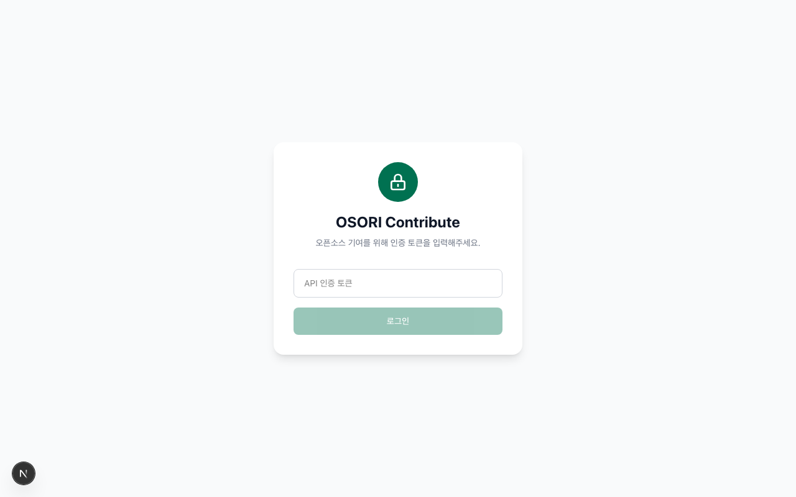
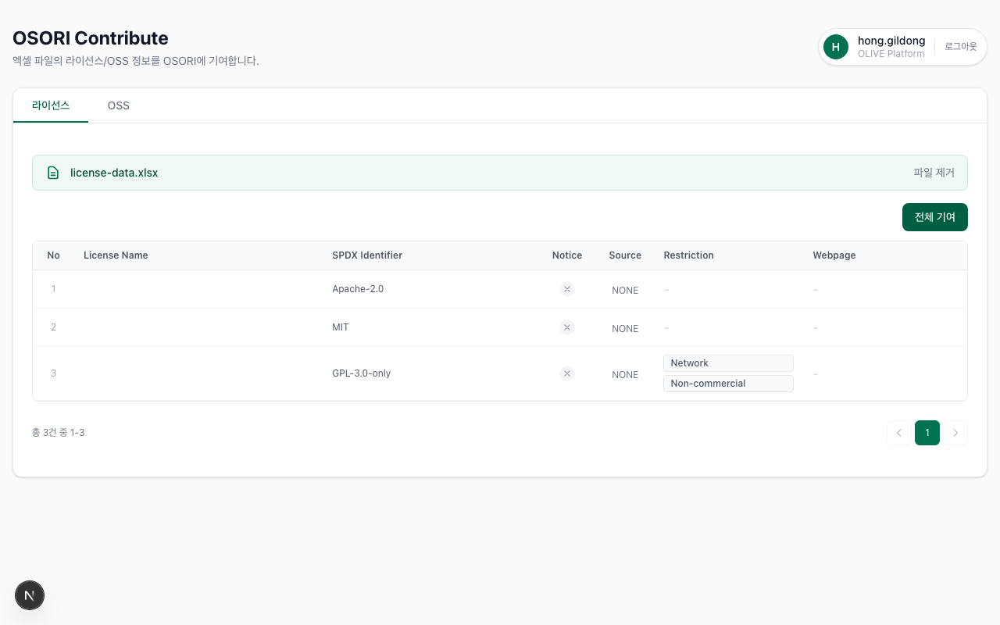
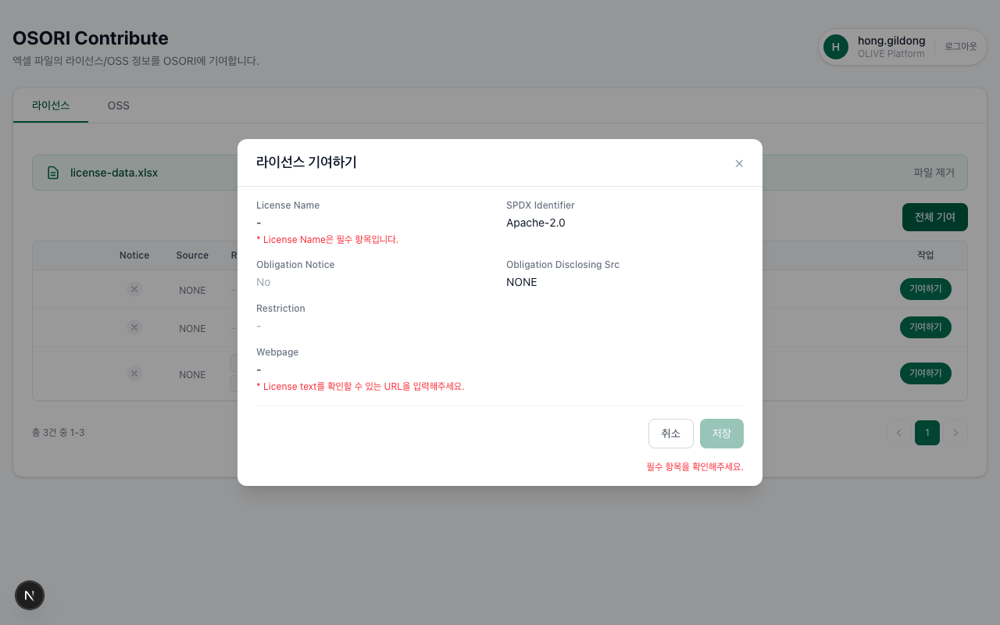
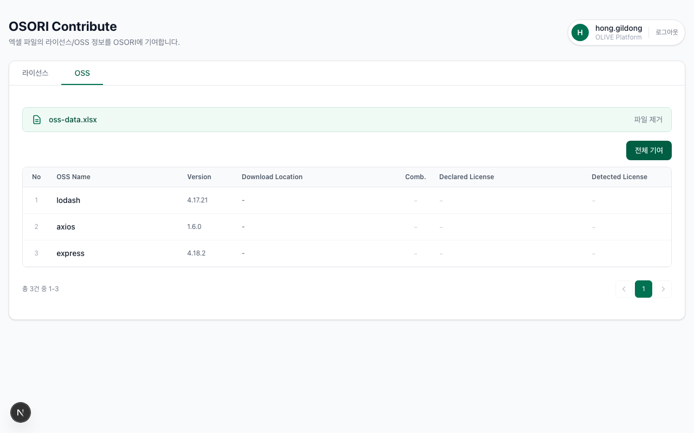
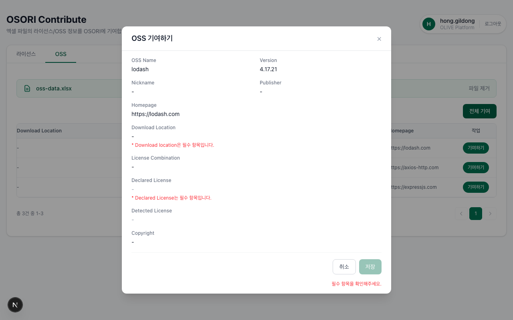

# OSORI Contribute

엑셀 파일의 라이선스/OSS 정보를 [OSORI](https://olis.or.kr) 시스템에 기여하는 웹 애플리케이션입니다.

## 기술 스택

- **Framework**: Next.js 16 (App Router)
- **UI**: React 19 + Tailwind CSS 4
- **Language**: TypeScript 5
- **Validation**: Zod 4
- **Excel**: xlsx (SheetJS)
- **Testing**: Vitest + Testing Library (163 tests)
- **Theme**: OLIVE UI 기반 녹색 계열

## 시작하기

### 사전 요구사항

- Node.js 21+
- npm

### 설치 및 실행

```bash
# 의존성 설치
npm install

# 개발 서버 실행
npm run dev

# 프로덕션 빌드
npm run build
npm start
```

개발 서버: http://localhost:3000

### Docker 실행

```bash
# 이미지 빌드
docker build -t osori-contribute .

# 컨테이너 실행
docker run -p 3000:3000 osori-contribute
```

docker-compose를 사용할 경우:

```bash
docker compose up -d
```

http://localhost:3000 으로 접속합니다.

### 테스트

```bash
# 테스트 실행
npm test

# 테스트 워치 모드
npm run test:watch
```

## 화면 가이드

> **스크린샷 갱신 필요**
> 아래 이미지는 이전 버전에서 촬영한 것으로, 현재 UI와 차이가 있습니다.
> 각 항목의 "현재 화면과 다른 점"을 참고하여 다시 촬영해 주세요.
> 촬영 경로: `docs/screenshots/`

### 1. 로그인

OSORI API 인증 토큰(JWT)을 입력하여 로그인합니다.



### 2. 라이선스 기여

엑셀 파일을 업로드하면 라이선스 목록이 테이블로 표시됩니다. 상단 왼쪽의 **검색창**으로 License Name을 걸러낼 수 있고, 오른쪽 **"전체 기여"** 버튼으로 일괄 처리하거나 각 행의 **"기여하기"** 버튼으로 개별 처리합니다. **작업 컬럼은 오른쪽에 고정**되어 가로 스크롤과 무관하게 항상 보입니다.



> 현재 화면과 다른 점: License Name 검색창, 페이지당 표시 개수 선택, 작업 컬럼 고정, Webpage 하이퍼링크, 수정된 행의 "수정됨" 배지

개별 기여 시 모달에서 **모든 항목을 직접 수정**한 뒤 저장할 수 있습니다. 검증은 수정 중인 값 기준으로 다시 계산되어, 필수 항목을 채우면 저장 버튼이 즉시 열립니다.



> 현재 화면과 다른 점: 모든 필드가 읽기 전용 텍스트에서 **입력 폼**으로 바뀜, Restriction 원클릭 추가 버튼, Webpage List 편집, "원래대로" 버튼

### 3. OSS 기여

OSS 탭에서 엑셀을 업로드하면 OSS 목록이 표시됩니다. 컬럼은 **No / OSS Name / Download Location / Declared License / Comb. / 작업** 6개로, Version은 OSS Name 아래, Homepage는 Download Location 아래에 부가 정보로 표시됩니다.



> 현재 화면과 다른 점: 컬럼 구성 변경(Detected License 제거, Version·Homepage 이동), OSS Name 검색창, 페이지당 표시 개수 선택, 작업 컬럼 고정, Download Location·Homepage 하이퍼링크

OSS 기여 모달에서도 모든 항목을 수정할 수 있으며, Declared/Detected License를 고치면 매핑 배지(`#ID` / `?`)가 즉시 다시 계산됩니다.



> 현재 화면과 다른 점: 모든 필드가 입력 폼으로 바뀜, 접이식 **"추가 정보"** 섹션(Description·Attribution·Compliance Notice·Release Date), Download Location 후보 URL 클릭 적용, "원래대로" 버튼

---

## 주요 기능

### 1. 인증 (로그인/로그아웃)

OSORI API 인증 토큰(JWT)을 입력하여 로그인합니다. 토큰에서 사용자 이름과 소속을 자동으로 파싱하여 헤더에 표시합니다. 세션 동안 토큰이 유지되며, 브라우저 탭을 닫으면 자동 로그아웃됩니다.

### 2. 엑셀 업로드

라이선스 또는 OSS 탭에서 엑셀 파일(.xlsx, .xls)을 **드래그앤드롭** 하거나 **클릭하여 선택**합니다. 업로드된 엑셀은 자동으로 파싱되어 테이블 형태로 표시됩니다. 파일명이 표시되며 "파일 제거" 버튼으로 초기화할 수 있습니다.

### 3. 라이선스 기여

| 기능 | 설명 |
|------|------|
| **SPDX 자동 조회** | 기여 시 SPDX Identifier로 OSORI에서 기존 라이선스를 먼저 검색합니다. |
| **중복 방지** | 이미 등록된 라이선스는 생성을 건너뛰고 성공 처리합니다. |
| **자동 생성** | 미등록 라이선스는 OSORI API를 통해 자동 생성합니다. |
| **Restriction 매핑** | 라이선스 제한사항(Network, Non-commercial 등)을 OSORI restriction ID로 자동 매핑합니다. |
| **입력 검증** | License Name 필수, Webpage URL 형식, SPDX Identifier 유효성 등을 사전 검증합니다. |
| **기여하기 모달** | 각 행의 기여 버튼 클릭 시 모든 항목을 수정할 수 있는 모달이 열립니다. |
| **Restriction 추가** | 아직 지정하지 않은 Restriction을 버튼 클릭으로 바로 추가합니다. |
| **전체 기여** | "전체 기여" 버튼으로 모든 항목을 순차적으로 일괄 처리합니다. 진행률이 실시간 표시됩니다. |

**기여 흐름:**
```
SPDX Identifier로 OSORI 조회
  → 존재하면 → 완료 (중복 방지)
  → 없으면 → 라이선스 생성 API 호출 → 성공/실패
```

### 4. OSS 기여

| 기능 | 설명 |
|------|------|
| **purl 자동 생성** | GitHub Download Location에서 Package URL (`pkg:github/owner/repo`)을 자동 생성합니다. |
| **OSS 중복 검사** | purl로 OSORI에서 기존 OSS를 먼저 검색합니다. |
| **버전 관리** | OSS가 존재하면 해당 버전이 있는지 추가 조회하고, 없는 버전만 생성합니다. |
| **라이선스 ID 매핑** | Declared/Detected License 이름을 OSORI 라이선스 ID로 자동 변환합니다. |
| **License Combination** | AND/OR 조합을 지원합니다. |
| **입력 검증** | Download Location URL, Copyright 형식 등을 사전 검증합니다. |
| **기여하기 모달** | 라이선스 배지·매핑 상태·검증 힌트를 보면서 모든 항목을 수정할 수 있습니다. |
| **추가 정보** | 화면에 없지만 OSORI로 전송되는 필드(Description, Attribution, Compliance Notice, Release Date)를 접이식 섹션에서 편집합니다. |
| **전체 기여** | "전체 기여" 버튼으로 모든 항목을 순차적으로 일괄 처리합니다. 진행률이 실시간 표시됩니다. |

**기여 흐름:**
```
Download Location → purl 생성 (GitHub만)
  → purl로 OSORI 조회
    → OSS 존재 → oss_master_id 획득
    → OSS 없음 → OSS 생성 API → oss_master_id 획득
  → 버전 조회
    → 버전 존재 → 완료 (중복 방지)
    → 버전 없음 → 라이선스 ID 매핑 → 버전 생성 API
```

### 5. 상태 표시

각 행의 기여 상태가 버튼 UI로 실시간 표시됩니다:

| 상태 | 표시 | 설명 |
|------|------|------|
| 대기 | 녹색 "기여하기" 버튼 | 기여 전 초기 상태 |
| 이미 존재함 | 회색 "이미 존재함" | SPDX/purl 사전 조회로 이미 등록된 항목 |
| 처리 중 | 스피너 + "처리 중..." | API 호출 진행 중 |
| 완료 | 녹색 체크 "완료" | 기여 성공, 데이터 셀 반투명 처리 |
| 실패 | 빨간색 "재시도" | 기여 실패, 클릭하여 재시도 가능 |

작업 컬럼은 오른쪽에 고정되어 있어 가로 스크롤과 무관하게 항상 보입니다. 반투명 처리는 행 전체가 아니라 데이터 셀에만 적용됩니다 — 고정된 셀에 투명도를 주면 아래로 스크롤되는 셀이 비쳐 보이기 때문입니다.

### 6. 항목 수정

모달에서 모든 항목을 직접 고칠 수 있습니다.

| 동작 | 설명 |
|------|------|
| **초안 편집** | 수정 중인 값은 모달 안에만 있습니다. **취소하면 원본이 그대로 남습니다.** |
| **실시간 검증** | 검증은 원본이 아니라 수정 중인 값 기준으로 다시 계산되어, 필수 항목을 채우면 저장 버튼이 즉시 열립니다. |
| **원래대로** | 편집 내용을 원본으로 되돌립니다. |
| **빈 값 처리** | 값을 비우면 빈 문자열이 아니라 `null`로 되돌려 원본 타입의 의미를 유지합니다. |
| **수정본 반영** | 저장을 시도한 시점에 수정본이 확정되어, 표와 "전체 기여"가 모두 수정본을 사용합니다. 저장에 실패해도 수정본은 유지됩니다. |
| **수정됨 표시** | 실제로 값이 달라진 행에 노란 **"수정됨"** 배지가 붙습니다. 배지에 마우스를 올리면 어떤 항목이 바뀌었는지 보입니다. |

### 7. 검색

각 목록 상단의 검색창으로 이름을 걸러냅니다. 대소문자를 구분하지 않는 부분 일치이며, 결과 건수가 옆에 표시됩니다.

- OSS 목록: **OSS Name** 기준
- 라이선스 목록: **License Name** 기준

검색 중에는 **"전체 기여"** 버튼이 **"검색 결과 기여 (N건)"** 으로 바뀌고, 화면에 보이는 항목만 처리합니다. 보이지 않는 항목까지 전송하면 의도하지 않은 대량 기여가 일어나기 때문입니다.

### 8. 페이지네이션

기본 20건씩 나뉘며, **20 / 50 / 100 / 200개씩** 중에서 고를 수 있습니다. 개수를 바꾸면 첫 페이지로 돌아갑니다.

### 9. URL 라우팅

화면 상태가 URL에 반영되어 뒤로/앞으로 가기가 동작하고, 같은 화면을 링크로 가리킬 수 있습니다.

```
/                                  → /license 로 리다이렉트
/license?q=apache&size=100&page=3
/oss?q=react&size=50
```

| 파라미터 | 설명 |
|----------|------|
| 경로 | `/license`, `/oss` — 활성 탭 |
| `q` | 검색어 (히스토리에 쌓지 않음) |
| `size` | 페이지당 표시 개수 (20/50/100/200 외의 값은 20으로 취급) |
| `page` | 페이지 번호 (1페이지는 파라미터를 붙이지 않음) |

`q`·`size`·`page`는 **보고 있는 탭의 값**입니다. 탭을 전환하면 떠나는 탭의 값을 기억했다가 돌아올 때 되돌려 주므로, 각 탭이 자기 검색어·개수·페이지를 유지합니다.

### 10. 탭 전환 시 데이터 유지

탭을 옮겨도 **업로드한 엑셀 데이터, 기여 상태, 수정본이 그대로 유지**됩니다. 두 탭을 모두 마운트한 채 숨기는 방식이며, 화면은 `(tabs)` 공유 레이아웃에서 그립니다. App Router는 라우트를 옮겨도 공유 레이아웃을 재마운트하지 않기 때문입니다.

> 데이터는 브라우저 메모리에만 있습니다. 새로고침하면 사라지므로 URL을 공유해도 상대방은 파일을 다시 올려야 합니다.

### 11. 하이퍼링크

목록의 URL은 새 탭 링크로 열립니다 (OSS의 Download Location·Homepage, 라이선스의 Webpage·Webpage List).

URL은 사용자가 올린 엑셀에서 오므로 신뢰할 수 없습니다. `http`/`https`로 파싱되는 값만 링크로 만들고, `javascript:` 같은 스킴은 평문으로 표시합니다.

### 12. 전체 기여 (배치)

"전체 기여" 버튼을 클릭하면 모든 항목을 순차적으로 처리합니다:
- 진행률 표시: `처리 중... (3/25)`
- 이미 성공했거나 이미 존재하는 항목은 자동 건너뜀
- 검증 실패 항목은 에러 메시지와 함께 건너뜀
- 실패한 항목은 행 아래에 빨간색 에러 메시지 표시
- 완료 후 **"기여 결과 보기"** 버튼으로 성공/존재/실패/미처리 요약을 확인
- 검색 중이라면 걸러진 항목만 처리 (버튼 문구가 "검색 결과 기여 (N건)"으로 바뀜)

## 프로젝트 구조

```
src/
├── app/                              # Next.js App Router
│   ├── api/
│   │   ├── contribute/route.ts       # 레거시 기여 API 프록시
│   │   └── osori/
│   │       ├── licenses/route.ts     # 라이선스 CRUD API 프록시
│   │       ├── oss/route.ts          # OSS CRUD API 프록시 (purl 조회 포함)
│   │       ├── oss-versions/route.ts # OSS 버전 CRUD API 프록시
│   │       └── restrictions/route.ts # Restriction 목록 조회 프록시
│   ├── (tabs)/                       # 탭 라우트 (공유 레이아웃)
│   │   ├── layout.tsx                # 화면 전체를 그림 (두 탭 모두 마운트 유지)
│   │   ├── license/page.tsx          # /license 경로만 정의
│   │   └── oss/page.tsx              # /oss 경로만 정의
│   ├── globals.css                   # Tailwind + OLIVE 테마
│   ├── layout.tsx                    # 루트 레이아웃
│   └── page.tsx                      # / → /license 리다이렉트
│
├── components/
│   ├── HomeView.tsx                  # 앱 셸 (탭 라우팅 + 탭별 파라미터 기억/복원)
│   ├── AuthTokenInput.tsx            # 전체 화면 로그인 폼
│   ├── Header.tsx                    # 헤더 (사용자 정보 + 로그아웃)
│   ├── TabNavigation.tsx             # 라이선스/OSS 탭 네비게이션
│   ├── ExcelUploader.tsx             # 드래그앤드롭 엑셀 업로더
│   ├── Modal.tsx                     # 공통 모달 껍데기
│   ├── FormField.tsx                 # 입력 필드 (Text/TextArea/Checkbox + 검증 힌트)
│   ├── SearchInput.tsx               # 검색창 (입력 지연 후 URL 반영)
│   ├── Pagination.tsx                # 페이지네이션 + 표시 개수 선택
│   ├── ContributeButton.tsx          # 기여 버튼 (상태별 UI)
│   ├── EditedBadge.tsx               # "수정됨" 배지 (변경 항목 툴팁)
│   ├── UrlLink.tsx                   # 안전한 URL만 링크로 렌더
│   ├── BatchResultModal.tsx          # 전체 기여 결과 요약 모달
│   ├── ErrorMessage.tsx              # 에러 메시지
│   ├── LoadingSkeleton.tsx           # 로딩 스켈레톤
│   ├── LicenseTab.tsx                # 라이선스 탭 컨테이너
│   ├── LicenseList.tsx               # 라이선스 목록 + 검색/개별/전체 기여
│   ├── LicenseContributeModal.tsx    # 라이선스 기여·수정 모달
│   ├── OssTab.tsx                    # OSS 탭 컨테이너
│   ├── DataList.tsx                  # 범용 데이터 목록 (미사용)
│   ├── OssList.tsx                   # OSS 목록 + 검색/개별/전체 기여
│   └── OssContributeModal.tsx        # OSS 기여·수정 모달
│
├── contexts/
│   └── AuthContext.tsx               # 인증 컨텍스트 (sessionStorage)
│
├── hooks/
│   ├── useAuth.ts                    # 인증 훅
│   ├── useDebounce.ts                # 값 변경 지연 훅
│   ├── usePageParam.ts               # ?page= 페이지 번호
│   ├── usePageSizeParam.ts           # ?size= 표시 개수 (허용 목록 검증)
│   ├── useQueryParam.ts              # ?q= 검색어
│   ├── useExcelData.ts               # 범용 엑셀 파싱 훅
│   ├── useLicenseData.ts             # 라이선스 엑셀 파싱 훅
│   ├── useLicenseMapping.ts          # 라이선스 이름→ID 매핑 훅
│   ├── useOssData.ts                 # OSS 엑셀 파싱 훅
│   └── useRestrictions.ts            # Restriction 목록 훅
│
├── lib/
│   ├── api-client.ts                 # 내부 API 클라이언트 (fetch 래퍼)
│   ├── osori-api.ts                  # OSORI 외부 API 호출
│   ├── osori-types.ts                # OSORI API 타입 정의
│   ├── types.ts                      # 공통 TypeScript 타입
│   ├── view-params.ts                # URL 파라미터 이름 + 탭 경로
│   ├── excel-parser.ts               # 범용 엑셀 파싱 유틸
│   ├── multi-value.ts                # 다중값 문자열 파싱 (단일 규칙)
│   ├── row-diff.ts                   # 원본 대비 변경된 필드 추출
│   ├── field-labels.ts               # 필드 키 → 화면 라벨
│   ├── url.ts                        # 링크로 만들어도 안전한 URL 판별
│   ├── license-parser.ts             # 라이선스 엑셀 컬럼 매핑
│   ├── license-mapper.ts             # 라이선스 → OSORI 요청 변환
│   ├── license-validation.ts         # 라이선스 입력 검증
│   ├── oss-parser.ts                 # OSS 엑셀 컬럼 매핑
│   ├── oss-mapper.ts                 # OSS → OSORI 요청 변환 + purl 생성
│   ├── oss-validation.ts             # OSS 입력 검증
│   └── external-api.ts               # 외부 API 프록시 유틸
│
└── test/
    └── setup.ts                      # Vitest 테스트 설정
```

### 계층 규칙

```
components → hooks → lib
```

단방향 의존입니다. `src/lib`은 React를 import하지 않는 순수 함수·타입만 두어 DOM 없이 테스트되고, 검증·매핑·파싱 로직이 컴포넌트로 새어 들어가지 않게 합니다.

## API 아키텍처

```
브라우저 (React) → Next.js API Routes → OSORI 외부 API (https://olis.or.kr:16443)
```

Next.js API Routes가 프록시 역할을 하여 CORS를 우회하고 외부 API와 안전하게 통신합니다.

### API 라우트

| 내부 경로 | 메서드 | 외부 경로 | 설명 |
|-----------|--------|-----------|------|
| `/api/osori/licenses` | `GET` | `GET /api/v2/admin/licenses` | SPDX Identifier로 라이선스 조회 |
| `/api/osori/licenses` | `POST` | `POST /api/v2/admin/licenses` | 라이선스 생성 |
| `/api/osori/oss` | `GET` | `GET /api/v2/admin/oss` | purl/downloadLocation으로 OSS 조회 |
| `/api/osori/oss` | `POST` | `POST /api/v2/admin/oss` | OSS 생성 |
| `/api/osori/oss-versions` | `GET` | `GET /api/v2/admin/oss/{id}/versions` | OSS 버전 목록 조회 |
| `/api/osori/oss-versions` | `POST` | `POST /api/v2/admin/oss-versions` | OSS 버전 생성 |
| `/api/osori/restrictions` | `GET` | `GET /api/v2/admin/restrictions` | Restriction 목록 조회 |
| `/api/contribute` | `POST` | `POST /api/v2/admin/licenses` or `oss` | 레거시 기여 API |

### 인증 흐름

```
클라이언트: X-Auth-Token 헤더
  → Next.js API Route: Authorization: Bearer 헤더로 변환
    → OSORI 외부 API
```

## 테스트

10개 테스트 파일, 총 163개 테스트 케이스:

| 파일 | 테스트 수 | 설명 |
|------|-----------|------|
| `lib/license-mapper.test.ts` | 10 | 라이선스 → OSORI 요청 변환 |
| `lib/oss-mapper.test.ts` | 21 | OSS → OSORI 요청 변환 + purl 생성 |
| `lib/row-diff.test.ts` | 9 | 변경 필드 추출 + 필드 라벨 매핑 |
| `lib/url.test.ts` | 6 | 링크 허용 스킴 판별 (`javascript:` 등 차단) |
| `hooks/useLicenseMapping.test.ts` | 9 | 라이선스 이름→ID 매핑 훅 |
| `components/HomeView.test.tsx` | 10 | 탭 경로 라우팅 + 탭별 파라미터 기억/복원 |
| `components/OssContributeModal.test.tsx` | 9 | OSS 모달 편집 (초안·검증·불변성·추가 정보) |
| `components/LicenseContributeModal.test.tsx` | 9 | 라이선스 모달 편집 (초안·검증·Restriction 추가) |
| `components/LicenseList.test.tsx` | 22 | 라이선스 기여 흐름, 검색, 표시 개수, Webpage 링크 |
| `components/OssList.test.tsx` | 58 | OSS 기여 흐름, 테이블 구성, 검색, 페이징, 링크, 수정본 반영 |

```bash
# 테스트 실행
npm test

# 특정 파일 테스트
npx vitest run src/lib/oss-mapper.test.ts
```

## 라이선스

Apache License 2.0 - [LICENSE](LICENSE) 파일을 참조하세요.
